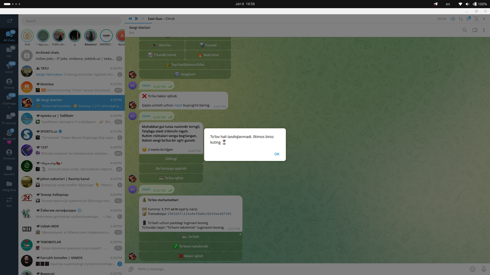

# ✅ TO'LOVNI TASDIQLASH - Oson Qo'llanma

## 📌 Muammo

Foydalanuvchi sherlar database'da to'lov qilgan, lekin botda she'rlar ochilmayapti.

## 🔧 Yechim: Qo'lda Tasdiqlash

### **Usul 1: /approve komandasi (ENG OSON)**

```bash
/approve TELEGRAM_ID
```

**Misol:**
```
/approve 7789445876
```

**Natija:**
```
✅ Muvaffaqiyatli!

Kamoliddin (@username)
🆔 7789445876

To'lov tasdiqlandi va foydalanuvchiga xabar yuborildi! 🎉
```

Foydalanuvchiga avtomatik xabar ketadi:
```
✅ To'lovingiz tasdiqlandi!

🎉 Endi siz cheksiz she'rlardan bahramand bo'lishingiz mumkin!

Davom etish uchun /start buyrug'ini bosing.
```

### **Usul 2: Admin Panel**

1. `/admin` komandasi
2. "⏳ Kutilayotgan to'lovlar" tugmasini bosing
3. To'lov ro'yxatini ko'ring
4. Keyin `/approve TELEGRAM_ID` yuboring

## 📊 To'lovni Tekshirish

### Sherlar database'da tekshirish:

```sql
-- Terminal'da:
PGPASSWORD=123456 psql -h 192.168.0.89 -U postgres -d sherlar

-- SQL:
SELECT * FROM payments 
WHERE telegram_id = 7789445876 
  AND amount = 1111 
  AND status = 'paid';
```

Agar natija chiqsa - to'lov bor, `/approve` bilan tasdiqlaymiz.

## 🔄 Avtomatik Tekshiruv (Kelajakda)

Bot hozir **qo'lda tasdiqlash** rejimida ishlayapti:
- ✅ Xavfsiz
- ✅ Nazorat qilish mumkin
- ✅ Xatolik ehtimoli yo'q

Kelajakda sherlar DB'ga to'g'ri ulanish bo'lganda, **avtomatik** rejim yoqiladi.

## 🎯 Tez Qo'llanma

**Foydalanuvchi shikoyat qilsa:**

1. **Telegram ID'sini oling** (foydalanuvchidan)
2. **Sherlar DB'ni tekshiring** (yuqoridagi SQL)
3. **Tasdiqlang**: `/approve TELEGRAM_ID`
4. ✅ Tayyor!

## 📝 Loglar

Bot ishlaganda terminal'da ko'rasiz:

```
🔍 Checking sherlar database for user: 7789445876
⚠️ Sherlar DB check failed, using local payments only
```

Bu normal - qo'lda tasdiqlash ishlatamiz.

## ⚙️ Environment Variables

`.env` faylida:

```properties
# Asosiy bot database
DB_HOST=192.168.0.89
DB_PORT=5432
DB_USER=postgres
DB_PASS=123456
DB_NAME=sevgi

# Sherlar database (to'lovlar)
SHERLAR_DB_HOST=192.168.0.89
SHERLAR_DB_PORT=5432
SHERLAR_DB_USER=postgres
SHERLAR_DB_PASS=123456
SHERLAR_DB_NAME=sherlar
```

## 🎉 Success Messages

**Admin uchun:**
```
✅ Muvaffaqiyatli!
User tasdiqlandi!
```

**Foydalanuvchi uchun:**
```
✅ To'lovingiz tasdiqlandi!
🎉 Endi cheksiz she'rlardan bahramand bo'lishingiz mumkin!
```

## 🔒 Xavfsizlik

- Faqat **Super Admin** (ID: 7789445876) tasdiqlashi mumkin
- Boshqalar `/approve` ishlatolmaydi
- Har bir tasdiqlash log'ga tushadi

---

**Eng oson yo'l: `/approve TELEGRAM_ID` ✅**
